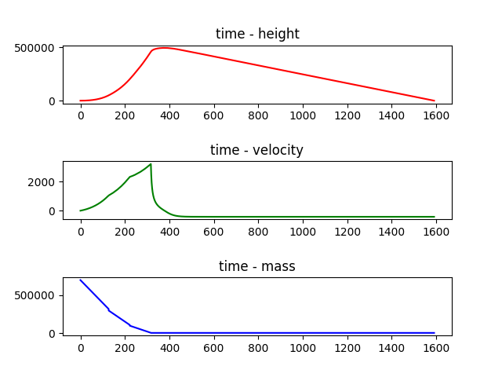

# simple rocket simulator

Calculating through RK4 methods.

Format of parameters.txt:

```
ρ g Cd v0 h0
m0 mR A m ̇f ue ∆t
m0 mR A m ̇f ue ∆t
m0 mR A m ̇f ue ∆t
...
```

Format of output.txt:
```
time height velocity mass
time height velocity mass
time height velocity mass
...
```

After compiling and execution. plot.py would show following curves:

